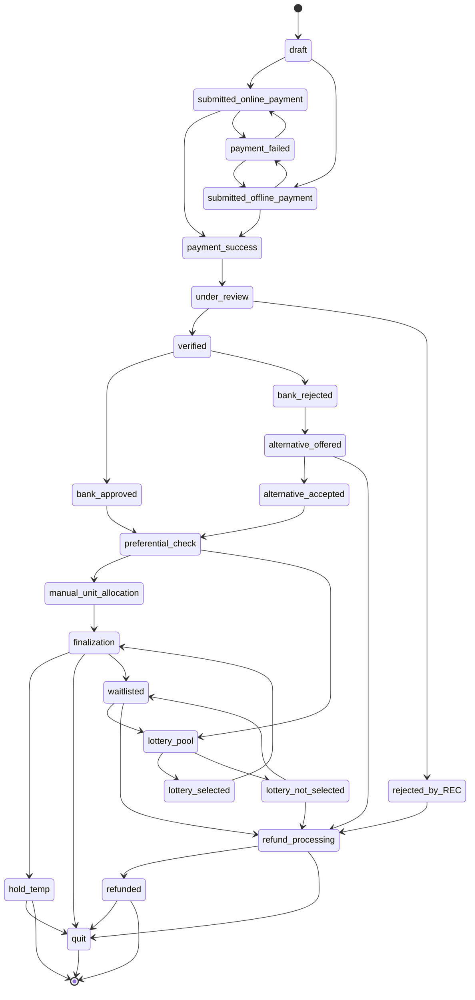

# Real Estate Lottery System - Beginner's Guide

*A comprehensive guide for understanding how the lottery allocation system works*

## Table of Contents

1. [Overview](#overview)
2. [Inventory Structure](#inventory-structure)
3. [Application Lifecycle Flow](#application-lifecycle-flow)
4. [How the Lottery Works](#how-the-lottery-works)
5. [Configuration Examples](#configuration-examples)
6. [Understanding Bias vs Fairness](#understanding-bias-vs-fairness)
7. [Visual Score Calculation](#visual-score-calculation)
8. [Practical Tuning Advice](#practical-tuning-advice)
9. [Summary](#summary)
10. [Appendix](#appendix)

---

## Overview

The Real Estate Lottery Management System (RELMS) is a comprehensive platform designed to fairly and transparently allocate housing units to qualified applicants. The system combines sophisticated inventory management, configurable lottery algorithms, and detailed application lifecycle tracking to ensure equitable distribution of real estate properties.

### Key Features

- **📋 Comprehensive Application Management**: End-to-end application processing from draft to finalization
- **🏠 Dynamic Inventory Control**: Real-time unit availability and allocation state management
- **🎯 Configurable Lottery Engine**: Flexible scoring rules and preference weights
- **📊 Transparent Process**: Complete audit trails and explainable allocation decisions
- **🔄 Multi-Phase Support**: Handle complex projects with multiple development phases
- **💳 Integrated Payment Processing**: Online and offline payment verification workflows
- **📈 Analytics & Reporting**: Comprehensive insights into lottery performance and outcomes

### System Architecture

RELMS is built on a modular architecture that separates business logic from configuration, enabling:

- **Flexibility**: Adapt to different housing programs without code changes
- **Scalability**: Handle multiple projects and thousands of applications simultaneously
- **Transparency**: Complete traceability of all decisions and state changes
- **Compliance**: Built-in audit trails and regulatory compliance features

---

## Inventory Structure

The Real Estate Lottery Management System (RELMS) organizes property inventory in a hierarchical structure to efficiently manage multiple projects, phases, and unit types.

### Inventory Hierarchy

```
🏢 PROJECT
├── 📋 Project Details (Name, Location, Developer, Status)
├── 🏗️ PHASES
│   ├── Phase 1
│   │   ├── 📊 Phase Configuration (Timeline, Rules, Pricing)
│   │   ├── 🏠 UNIT TYPES
│   │   │   ├── 1BHK Units
│   │   │   │   ├── Unit A-101 (available/allotted/sold/preferred/hold)
│   │   │   │   ├── Unit A-102 (available/allotted/sold/preferred/hold)
│   │   │   │   └── Unit A-103 (available/allotted/sold/preferred/hold)
│   │   │   ├── 2BHK Units
│   │   │   │   ├── Unit B-201 (available/allotted/sold/preferred/hold)
│   │   │   │   └── Unit B-202 (available/allotted/sold/preferred/hold)
│   │   │   └── 3BHK Units
│   │   │       └── Unit C-301 (available/allotted/sold/preferred/hold)
│   │   └── 🎯 LOTTERY CONFIGURATION
│   │       ├── Scoring Rules
│   │       ├── Preference Weights
│   │       └── Allocation Strategy
│   └── Phase 2
│       └── (Similar structure)
└── 📈 PROJECT ANALYTICS
    ├── Sales Performance
    ├── Lottery Results
    └── Customer Demographics
```

### Key Components

#### **1. Project Level**
- **Project ID**: Unique identifier for each real estate project
- **Basic Information**: Name, location, developer details, total units
- **Status Tracking**: Planning, Active, Completed, Suspended
- **Financial Overview**: Total value, pricing strategy, payment terms

#### **2. Phase Management**
- **Phase Segmentation**: Projects divided into manageable phases
- **Timeline Control**: Start/end dates, milestone tracking
- **Configuration Inheritance**: Phases can inherit or override project settings
- **Independent Lotteries**: Each phase can run separate lottery processes

#### **3. Unit Inventory**
- **Unit Types**: 1BHK, 2BHK, 3BHK, Penthouse, etc.
- **Unit Specifications**: Size, floor, facing, amenities, pricing
- **Allocation State**: available, allotted, sold, preferred, hold
- **Unit Status**: Active, Hold, Landowner, Sold
- **Allocation Tracking**: Winner assignment, payment status, handover

#### **4. Dynamic Configuration**
- **Lottery Rules**: Customizable scoring and preference rules per phase
- **Pricing Strategy**: Base price, discounts, payment plans
- **Eligibility Criteria**: Income limits, occupation preferences, residency requirements
- **Booking Process**: Application flow, document requirements, verification steps

### Inventory Management Features

#### **Real-Time Status Updates**
```json
{
  "unitId": "A-101",
  "allocationState": "available",
  "unitStatus": "Active",
  "lastUpdated": "2024-01-15T10:30:00Z",
  "allottedApplicationId": null,
  "isVisible": true
}
```

#### **Batch Operations**
- **Bulk Status Updates**: Mark multiple units as available/sold
- **Price Adjustments**: Apply pricing changes across unit types
- **Configuration Deployment**: Roll out lottery rules to multiple phases

#### **Inventory Analytics**
- **Availability Reports**: Real-time unit availability across projects
- **Sales Performance**: Conversion rates, popular unit types
- **Demand Analysis**: Application patterns, preference trends
- **Revenue Tracking**: Sales value, payment collection status

### Integration Points

#### **Application Management**
- Applications linked to specific project phases
- Unit preference mapping to available inventory
- Automatic eligibility checking against project criteria

#### **Lottery Engine**
- Dynamic unit allocation based on inventory availability
- Preference matching (applicant choices vs available units)
- Waitlist management for sold-out categories

---

## Application Lifecycle Flow

The Real Estate Lottery Management System (RELMS) follows a comprehensive application lifecycle that guides each applicant through various stages from initial draft to final allocation or exit.

### Application Status Flow Overview

The application lifecycle consists of multiple stages designed to ensure fair processing, verification, and allocation of units. Each application progresses through these stages based on system rules and manual interventions.

### Application Lifecycle State Diagram



### Stage Descriptions

#### **Initial Application Stages**

**1. Draft**
- Application is being created/edited by applicant
- No payment required at this stage
- Can transition to either online or offline payment submission

**2. Submitted (Payment Processing)**
- `submitted_online_payment`: Application submitted with online payment
- `submitted_offline_payment`: Application submitted with offline payment method
- Awaiting payment confirmation

#### **Payment Verification**

**3. Payment Status**
- `payment_success`: Payment confirmed and processed successfully
- `payment_failed`: Payment processing failed, returns to submission stage

#### **Review and Verification Process**

**4. Under Review**
- Application documents and eligibility being reviewed by REC (Real Estate Committee)
- Can proceed to verification or be rejected

**5. Verification Outcomes**
- `verified`: Application meets all eligibility criteria
- `rejected_by_REC`: Application rejected due to eligibility issues, proceeds to refund

#### **Bank Approval Process**

**6. Bank Decision**
- `bank_approved`: Financial verification successful
- `bank_rejected`: Bank rejects the application for financing

**7. Alternative Process** (for bank rejected applications)
- `alternative_offered`: System offers alternative units/terms
- `alternative_accepted`: Applicant accepts the alternative offer

#### **Allocation Process**

**8. Preferential Check**
- System checks if applicant qualifies for preferential allocation
- Routes to either manual allocation or lottery pool

**9. Allocation Methods**
- `manual_unit_allocation`: Direct allocation for preferential candidates
- `lottery_pool`: Added to lottery system for random/weighted selection

#### **Lottery Outcomes**

**10. Lottery Results**
- `lottery_selected`: Won a unit in the lottery
- `lottery_not_selected`: Not selected in lottery

#### **Final Stages**

**11. Finalization**
- Unit allocation confirmed, paperwork and agreements processing
- Can lead to temporary hold, completion, or return to waitlist

**12. Exit States**
- `hold_temp`: Temporary hold status
- `quit`: Application terminated/withdrawn
- `waitlisted`: Placed on waitlist for future opportunities
- `refunded`: Refund processed for unsuccessful applications

### Key Lifecycle Features

#### **Flexible Pathways**
- Multiple entry points for different payment methods
- Alternative pathways for rejected applications
- Circular flows for waitlisted applicants

#### **Quality Gates**
- Payment verification checkpoint
- REC review and approval
- Bank financial verification
- Preferential eligibility assessment

#### **Recovery Mechanisms**
- Failed payments can retry with different methods
- Bank-rejected applications get alternative offers
- Waitlisted applications can re-enter lottery pools
- Comprehensive refund processing for unsuccessful cases

#### **State Transitions Validation**
The system enforces valid transitions between states to maintain data integrity and ensure proper application flow. Invalid transitions are blocked to prevent inconsistent application states.

---

## How the Lottery Works

The Real Estate Lottery System is designed to fairly allocate available housing units to applicants based on configurable scoring rules. Think of it as a sophisticated "weighted raffle" system.

### Step-by-Step Process

#### 1. **Applications Collection**
- People submit applications with their personal information (income, occupation, family size, etc.)
- All valid applications go into a "lottery pool"

#### 2. **Scoring Each Applicant**
- The system calculates a score for each applicant based on predefined rules
- **Score Formula**: `Total Score = (Rule 1 Score) + (Rule 2 Score) + ... + (Rule N Score)`
- **Individual Rule Score**: `Base Weight × Value Weight`

#### 3. **Ranking Applicants**
- All applicants are sorted by their total score (highest to lowest)
- Higher scores = better chance of getting a unit

#### 4. **Unit Allocation**
- Winners are selected starting from the highest score
- If there are 10 units available, the top 10 scored applicants win
- **Tie-breaking**: If multiple people have the same score at the cutoff point, winners are chosen randomly among them

#### 5. **Results**
- **Winners**: Get assigned a specific unit
- **Waitlist**: Remaining applicants are ranked in order for future availability

### Real Example
Let's say there are **3 units available** and **5 applicants**:

| Applicant | Score | Result |
|-----------|-------|--------|
| Alice     | 8.5   | ✅ **Winner** (Unit A) |
| Bob       | 7.2   | ✅ **Winner** (Unit B) |
| Charlie   | 7.2   | ✅ **Winner** (Unit C) - *Random selection among tied scores* |
| Diana     | 7.2   | ❌ Waitlist #1 - *Random selection among tied scores* |
| Eve       | 5.1   | ❌ Waitlist #2 |

---

## Configuration Examples

### Example 1: Basic Income-Based Preference

**Scenario**: Prioritize lower-income applicants for affordable housing

```json
{
  "userPreferenceRules": [
    {
      "formId": "personalInfo",
      "fieldName": "grossAnnualIncome",
      "baseWeight": 1.0,
      "valueMap": [
        { "value": "Below 3 Lakhs", "weight": 3.0 },
        { "value": "3-6 Lakhs", "weight": 2.0 },
        { "value": "6-10 Lakhs", "weight": 1.0 },
        { "value": "Above 10 Lakhs", "weight": 0.5 }
      ]
    }
  ]
}
```

**What this does**:
- Someone earning "Below 3 Lakhs" gets: `1.0 × 3.0 = 3.0 points`
- Someone earning "Above 10 Lakhs" gets: `1.0 × 0.5 = 0.5 points`

### Example 2: Multi-Factor Scoring

**Scenario**: Consider income, occupation, and disability status

```json
{
  "userPreferenceRules": [
    {
      "formId": "personalInfo",
      "fieldName": "grossAnnualIncome",
      "baseWeight": 0.5,
      "valueMap": [
        { "value": "Below 3 Lakhs", "weight": 3.0 },
        { "value": "3-6 Lakhs", "weight": 2.0 },
        { "value": "Above 6 Lakhs", "weight": 1.0 }
      ]
    },
    {
      "formId": "personalInfo", 
      "fieldName": "occupation",
      "baseWeight": 0.3,
      "valueMap": [
        { "value": "Govt. Service", "weight": 2.5 },
        { "value": "Private Service", "weight": 2.0 },
        { "value": "Self Employed", "weight": 1.5 },
        { "value": "Unemployed", "weight": 3.0 }
      ]
    },
    {
      "formId": "personalInfo",
      "fieldName": "isDisabled", 
      "baseWeight": 0.8,
      "valueMap": [
        { "value": "true", "weight": 2.0 },
        { "value": "false", "weight": 1.0 }
      ]
    }
  ]
}
```

**Sample Calculation**:
For an applicant who is:
- Low income (Below 3 Lakhs): `0.5 × 3.0 = 1.5`
- Government employee: `0.3 × 2.5 = 0.75`
- Not disabled: `0.8 × 1.0 = 0.8`
- **Total Score**: `1.5 + 0.75 + 0.8 = 3.05`

### Example 3: Fair/Balanced Configuration

**Scenario**: Minimize bias by using equal weights

```json
{
  "userPreferenceRules": [
    {
      "formId": "personalInfo",
      "fieldName": "grossAnnualIncome",
      "baseWeight": 1.0,
      "valueMap": [
        { "value": "Below 3 Lakhs", "weight": 1.2 },
        { "value": "3-6 Lakhs", "weight": 1.1 },
        { "value": "6-10 Lakhs", "weight": 1.0 },
        { "value": "Above 10 Lakhs", "weight": 0.9 }
      ]
    },
    {
      "formId": "personalInfo",
      "fieldName": "familySize", 
      "baseWeight": 1.0,
      "valueMap": [
        { "value": "1-2 members", "weight": 0.9 },
        { "value": "3-4 members", "weight": 1.0 },
        { "value": "5+ members", "weight": 1.1 }
      ]
    }
  ]
}
```

---

## Understanding Bias vs Fairness

### What is Bias in This Context?

**Bias** occurs when the lottery system heavily favors specific groups over others. This isn't necessarily bad - it depends on your housing program's goals.

### What is Fairness?

**Fairness** means giving more equal opportunities to all applicants, regardless of their characteristics.

### The Bias-Fairness Spectrum

```
HIGH BIAS                           BALANCED                         HIGH FAIRNESS
(Strong Preferences)                                                (Equal Treatment)
        |                              |                                    |
   Targets specific              Some preference for           Nearly equal chance
   groups heavily               priority groups               for all applicants
```

### Visual Example: Weight Impact

Consider scoring based on income level:

#### **High Bias Configuration** (Strongly favors high income)
```json
"valueMap": [
  { "value": "Low Income", "weight": 0.2 },     // 📉 Major disadvantage
  { "value": "Medium Income", "weight": 1.0 },  // 📊 Baseline
  { "value": "High Income", "weight": 5.0 }     // 📈 Very high advantage
]
```

**Result**: High-income applicants have 25x better scoring than low-income applicants

#### **Balanced Configuration** (Moderate preference)
```json
"valueMap": [
  { "value": "Low Income", "weight": 0.8 },     // 📉 Slight disadvantage  
  { "value": "Medium Income", "weight": 1.0 },  // 📊 Baseline
  { "value": "High Income", "weight": 1.3 }     // 📈 Slight advantage
]
```

**Result**: High-income applicants have 1.6x better scoring than low-income applicants

#### **Fair Configuration** (Nearly equal treatment)
```json
"valueMap": [
  { "value": "Low Income", "weight": 1.0 },     // 📊 Equal
  { "value": "Medium Income", "weight": 1.0 },  // 📊 Equal  
  { "value": "High Income", "weight": 1.0 }     // 📊 Equal
]
```

**Result**: All income groups have equal opportunity

### Bias Warning Signs

❌ **High Bias Indicators**:
- Weight differences greater than 3:1 ratio
- Only one group gets high weights while others get very low weights
- Many rules all favor the same small group

✅ **Balanced Indicators**:
- Weight differences within 2:1 ratio
- Multiple groups receive preference across different rules
- Diverse criteria that don't all benefit the same applicants

---

## Visual Score Calculation

### Score Calculation Flowchart

```
    📋 APPLICANT DATA
            ↓
    ⚖️  SCORING RULES
            ↓
   📊 INDIVIDUAL RULE SCORES
            ↓
   ➕ TOTAL SCORE CALCULATION  
            ↓
   📈 RANKING & SELECTION
            ↓
   🏠 UNIT ALLOCATION
```

### Detailed Examples: Fairness vs Bias vs Randomization

Let's walk through concrete examples showing how different configurations affect outcomes, including how randomization works for tie-breaking.

#### **Scenario Setup**
We have **3 units available** and **6 applicants** with the following profiles:

| Applicant | Income | Credit Score | Occupation |
|-----------|--------|--------------|------------|
| **Alice** | High (₹12L) | Excellent | Private Service |
| **Bob** | Medium (₹5L) | Good | Govt Service |
| **Charlie** | Low (₹2L) | Poor | Unemployed |
| **Diana** | High (₹15L) | Excellent | Private Service |
| **Eve** | Medium (₹6L) | Good | Private Service |
| **Frank** | Low (₹3L) | Good | Govt Service |

---

#### **Example 1: FAIR Configuration (Equal Treatment)**

**Configuration:**
```json
{
  "userPreferenceRules": [
    {
      "fieldName": "grossAnnualIncome",
      "baseWeight": 1.0,
      "valueMap": [
        { "value": "Low", "weight": 1.0 },
        { "value": "Medium", "weight": 1.0 },
        { "value": "High", "weight": 1.0 }
      ]
    },
    {
      "fieldName": "creditScore",
      "baseWeight": 1.0,
      "valueMap": [
        { "value": "Poor", "weight": 1.0 },
        { "value": "Good", "weight": 1.0 },
        { "value": "Excellent", "weight": 1.0 }
      ]
    },
    {
      "fieldName": "occupation",
      "baseWeight": 1.0,
      "valueMap": [
        { "value": "Unemployed", "weight": 1.0 },
        { "value": "Private Service", "weight": 1.0 },
        { "value": "Govt Service", "weight": 1.0 }
      ]
    }
  ]
}
```

**Score Calculations:**
- **Alice**: (1.0 × 1.0) + (1.0 × 1.0) + (1.0 × 1.0) = **3.0**
- **Bob**: (1.0 × 1.0) + (1.0 × 1.0) + (1.0 × 1.0) = **3.0**
- **Charlie**: (1.0 × 1.0) + (1.0 × 1.0) + (1.0 × 1.0) = **3.0**
- **Diana**: (1.0 × 1.0) + (1.0 × 1.0) + (1.0 × 1.0) = **3.0**
- **Eve**: (1.0 × 1.0) + (1.0 × 1.0) + (1.0 × 1.0) = **3.0**
- **Frank**: (1.0 × 1.0) + (1.0 × 1.0) + (1.0 × 1.0) = **3.0**

**Result:** All applicants have identical scores = **3.0**

**🎲 RANDOMIZATION KICKS IN:**
Since all 6 applicants are tied at 3.0 and we need to select 3 winners, the system randomly selects 3 out of 6.

**Possible Outcome:**
- ✅ **Winners** (randomly selected): Bob, Eve, Frank
- ❌ **Waitlist**: Alice (#1), Diana (#2), Charlie (#3)

**Fairness Level**: 100% - Everyone has equal opportunity

---

#### **Example 2: BIASED Configuration (Favors High Income)**

**Configuration:**
```json
{
  "userPreferenceRules": [
    {
      "fieldName": "grossAnnualIncome",
      "baseWeight": 3.0,
      "valueMap": [
        { "value": "Low", "weight": 0.5 },
        { "value": "Medium", "weight": 1.5 },
        { "value": "High", "weight": 4.0 }
      ]
    },
    {
      "fieldName": "creditScore",
      "baseWeight": 2.0,
      "valueMap": [
        { "value": "Poor", "weight": 0.3 },
        { "value": "Good", "weight": 1.5 },
        { "value": "Excellent", "weight": 3.0 }
      ]
    },
    {
      "fieldName": "occupation",
      "baseWeight": 1.0,
      "valueMap": [
        { "value": "Unemployed", "weight": 0.2 },
        { "value": "Private Service", "weight": 2.0 },
        { "value": "Govt Service", "weight": 2.5 }
      ]
    }
  ]
}
```

**Score Calculations:**
- **Alice**: (3.0 × 4.0) + (2.0 × 3.0) + (1.0 × 2.0) = 12.0 + 6.0 + 2.0 = **20.0**
- **Bob**: (3.0 × 1.5) + (2.0 × 1.5) + (1.0 × 2.5) = 4.5 + 3.0 + 2.5 = **10.0**
- **Charlie**: (3.0 × 0.5) + (2.0 × 0.3) + (1.0 × 0.2) = 1.5 + 0.6 + 0.2 = **2.3**
- **Diana**: (3.0 × 4.0) + (2.0 × 3.0) + (1.0 × 2.0) = 12.0 + 6.0 + 2.0 = **20.0**
- **Eve**: (3.0 × 1.5) + (2.0 × 1.5) + (1.0 × 2.0) = 4.5 + 3.0 + 2.0 = **9.5**
- **Frank**: (3.0 × 0.5) + (2.0 × 1.5) + (1.0 × 2.5) = 1.5 + 3.0 + 2.5 = **7.0**

**Ranking:**
1. **Alice & Diana**: 20.0 (tied)
2. **Bob**: 10.0
3. **Eve**: 9.5
4. **Frank**: 7.0
5. **Charlie**: 2.3

**🎲 RANDOMIZATION FOR TIES:**
Alice and Diana are tied for 1st place. Since we have 3 units:
- Both Alice and Diana automatically win (they're clearly in top 3)
- The 3rd spot goes to Bob (next highest score)

**Final Result:**
- ✅ **Winners**: Alice, Diana, Bob
- ❌ **Waitlist**: Eve (#1), Frank (#2), Charlie (#3)

**Bias Level**: High - Strongly favors high-income applicants (Alice/Diana scored 8.7x higher than Charlie)

---

#### **Example 3: BALANCED Configuration (Moderate Bias)**

**Configuration:**
```json
{
  "userPreferenceRules": [
    {
      "fieldName": "grossAnnualIncome",
      "baseWeight": 1.2,
      "valueMap": [
        { "value": "Low", "weight": 0.8 },
        { "value": "Medium", "weight": 1.0 },
        { "value": "High", "weight": 1.3 }
      ]
    },
    {
      "fieldName": "creditScore",
      "baseWeight": 1.5,
      "valueMap": [
        { "value": "Poor", "weight": 0.7 },
        { "value": "Good", "weight": 1.0 },
        { "value": "Excellent", "weight": 1.4 }
      ]
    },
    {
      "fieldName": "occupation",
      "baseWeight": 1.0,
      "valueMap": [
        { "value": "Unemployed", "weight": 0.6 },
        { "value": "Private Service", "weight": 1.0 },
        { "value": "Govt Service", "weight": 1.2 }
      ]
    }
  ]
}
```

**Score Calculations:**
- **Alice**: (1.2 × 1.3) + (1.5 × 1.4) + (1.0 × 1.0) = 1.56 + 2.1 + 1.0 = **4.66**
- **Bob**: (1.2 × 1.0) + (1.5 × 1.0) + (1.0 × 1.2) = 1.2 + 1.5 + 1.2 = **3.9**
- **Charlie**: (1.2 × 0.8) + (1.5 × 0.7) + (1.0 × 0.6) = 0.96 + 1.05 + 0.6 = **2.61**
- **Diana**: (1.2 × 1.3) + (1.5 × 1.4) + (1.0 × 1.0) = 1.56 + 2.1 + 1.0 = **4.66**
- **Eve**: (1.2 × 1.0) + (1.5 × 1.0) + (1.0 × 1.0) = 1.2 + 1.5 + 1.0 = **3.7**
- **Frank**: (1.2 × 0.8) + (1.5 × 1.0) + (1.0 × 1.2) = 0.96 + 1.5 + 1.2 = **3.66**

**Ranking:**
1. **Alice & Diana**: 4.66 (tied)
2. **Bob**: 3.9
3. **Eve**: 3.7
4. **Frank**: 3.66
5. **Charlie**: 2.61

**🎲 RANDOMIZATION FOR TIES:**
Alice and Diana tied for 1st place. Both automatically win, plus Bob gets the 3rd spot.

**Final Result:**
- ✅ **Winners**: Alice, Diana, Bob
- ❌ **Waitlist**: Eve (#1), Frank (#2), Charlie (#3)

**Bias Level**: Moderate - Slight preference for high-income applicants (Alice/Diana scored 1.8x higher than Charlie)

---

#### **Complex Tie-Breaking Example**

Let's say we had a different scenario where the scores were:

| Applicant | Score |
|-----------|-------|
| Alice | 5.2 |
| Bob | 4.1 |
| Charlie | 4.1 |
| Diana | 4.1 |
| Eve | 3.8 |
| Frank | 3.8 |

With **3 units available:**

1. **Alice** automatically wins (highest score: 5.2)
2. **Bob, Charlie, Diana** are tied at 4.1 for spots #2 and #3
3. **🎲 Randomization**: System randomly selects 2 out of these 3 tied applicants
4. **Eve & Frank** go to waitlist (lower scores)

**Possible Outcome:**
- ✅ **Winners**: Alice, Charlie, Diana (Bob randomly excluded from tie)
- ❌ **Waitlist**: Bob (#1), Eve (#2), Frank (#3)

**Key Point**: Even with identical scores, some tied applicants may not win due to limited units.

---

### Real Estate Lottery Examples: Income, Property Preference & Occupation

Let's use more realistic real estate fields to show fairness vs bias vs randomization in action.

#### **Scenario Setup**
We have **2 premium units available** and **5 applicants**:

| Applicant | Gross Annual Income | Property Preference | Occupation |
|-----------|-------------------|-------------------|------------|
| **Raj** | ₹8 Lakhs | 2BHK | Software Engineer |
| **Priya** | ₹15 Lakhs | 3BHK | Doctor |
| **Amit** | ₹4 Lakhs | 1BHK | Teacher |
| **Neha** | ₹12 Lakhs | 2BHK | Bank Manager |
| **Suresh** | ₹6 Lakhs | 2BHK | Government Officer |

**Available Units:**
- Unit A: 2BHK Premium 
- Unit B: 3BHK Premium

---

#### **Example 1: FAIR Configuration (Equal Treatment)**

**Configuration:**
```json
{
  "userPreferenceRules": [
    {
      "fieldName": "grossAnnualIncome",
      "baseWeight": 1.0,
      "valueMap": [
        { "value": "Below 5 Lakhs", "weight": 1.0 },
        { "value": "5-10 Lakhs", "weight": 1.0 },
        { "value": "Above 10 Lakhs", "weight": 1.0 }
      ]
    },
    {
      "fieldName": "propertyPreference",
      "baseWeight": 1.0,
      "valueMap": [
        { "value": "1BHK", "weight": 1.0 },
        { "value": "2BHK", "weight": 1.0 },
        { "value": "3BHK", "weight": 1.0 }
      ]
    },
    {
      "fieldName": "occupation",
      "baseWeight": 1.0,
      "valueMap": [
        { "value": "Teacher", "weight": 1.0 },
        { "value": "Software Engineer", "weight": 1.0 },
        { "value": "Doctor", "weight": 1.0 },
        { "value": "Bank Manager", "weight": 1.0 },
        { "value": "Government Officer", "weight": 1.0 }
      ]
    }
  ]
}
```

**Step-by-Step Score Calculations:**

**Raj** (₹8L, 2BHK, Software Engineer):
- Income: 1.0 × 1.0 = 1.0
- Property: 1.0 × 1.0 = 1.0  
- Occupation: 1.0 × 1.0 = 1.0
- **Total Score: 3.0**

**Priya** (₹15L, 3BHK, Doctor):
- Income: 1.0 × 1.0 = 1.0
- Property: 1.0 × 1.0 = 1.0
- Occupation: 1.0 × 1.0 = 1.0
- **Total Score: 3.0**

**Amit** (₹4L, 1BHK, Teacher):
- Income: 1.0 × 1.0 = 1.0
- Property: 1.0 × 1.0 = 1.0
- Occupation: 1.0 × 1.0 = 1.0
- **Total Score: 3.0**

**Neha** (₹12L, 2BHK, Bank Manager):
- Income: 1.0 × 1.0 = 1.0
- Property: 1.0 × 1.0 = 1.0
- Occupation: 1.0 × 1.0 = 1.0
- **Total Score: 3.0**

**Suresh** (₹6L, 2BHK, Government Officer):
- Income: 1.0 × 1.0 = 1.0
- Property: 1.0 × 1.0 = 1.0
- Occupation: 1.0 × 1.0 = 1.0
- **Total Score: 3.0**

**Result:** All 5 applicants tied at **3.0**

**🎲 RANDOMIZATION PROCESS:**
Since all applicants have identical scores and we need to select 2 winners from 5 applicants, the system randomly selects 2.

**Random Selection Algorithm:**
1. Put all 5 names in a "digital hat": [Raj, Priya, Amit, Neha, Suresh]
2. Randomly draw 2 names
3. Assign units based on their property preference

**Possible Outcome:**
- 🎯 **Random Draw**: Amit and Neha selected
- ✅ **Winner 1**: Amit gets Unit A (2BHK) - closest to his 1BHK preference
- ✅ **Winner 2**: Neha gets Unit B (3BHK) - matches her 2BHK preference well
- ❌ **Waitlist**: Raj (#1), Priya (#2), Suresh (#3)

**Fairness Level: 100%** - Everyone had equal 40% chance (2/5) of winning

---

#### **Example 2: BIASED Configuration (Real Estate Company Preference)**

**Configuration:**
```json
{
  "userPreferenceRules": [
    {
      "fieldName": "grossAnnualIncome",
      "baseWeight": 3.0,
      "valueMap": [
        { "value": "Below 5 Lakhs", "weight": 0.3 },
        { "value": "5-10 Lakhs", "weight": 1.5 },
        { "value": "Above 10 Lakhs", "weight": 4.0 }
      ]
    },
    {
      "fieldName": "propertyPreference",
      "baseWeight": 2.0,
      "valueMap": [
        { "value": "1BHK", "weight": 0.5 },
        { "value": "2BHK", "weight": 2.0 },
        { "value": "3BHK", "weight": 3.0 }
      ]
    },
    {
      "fieldName": "occupation",
      "baseWeight": 1.5,
      "valueMap": [
        { "value": "Teacher", "weight": 0.8 },
        { "value": "Software Engineer", "weight": 2.5 },
        { "value": "Doctor", "weight": 3.0 },
        { "value": "Bank Manager", "weight": 2.8 },
        { "value": "Government Officer", "weight": 2.0 }
      ]
    }
  ]
}
```

**Step-by-Step Score Calculations:**

**Raj** (₹8L, 2BHK, Software Engineer):
- Income: 3.0 × 1.5 = 4.5
- Property: 2.0 × 2.0 = 4.0
- Occupation: 1.5 × 2.5 = 3.75
- **Total Score: 12.25**

**Priya** (₹15L, 3BHK, Doctor):
- Income: 3.0 × 4.0 = 12.0
- Property: 2.0 × 3.0 = 6.0
- Occupation: 1.5 × 3.0 = 4.5
- **Total Score: 22.5**

**Amit** (₹4L, 1BHK, Teacher):
- Income: 3.0 × 0.3 = 0.9
- Property: 2.0 × 0.5 = 1.0
- Occupation: 1.5 × 0.8 = 1.2
- **Total Score: 3.1**

**Neha** (₹12L, 2BHK, Bank Manager):
- Income: 3.0 × 4.0 = 12.0
- Property: 2.0 × 2.0 = 4.0
- Occupation: 1.5 × 2.8 = 4.2
- **Total Score: 20.2**

**Suresh** (₹6L, 2BHK, Government Officer):
- Income: 3.0 × 1.5 = 4.5
- Property: 2.0 × 2.0 = 4.0
- Occupation: 1.5 × 2.0 = 3.0
- **Total Score: 11.5**

**Final Ranking:**
1. **Priya**: 22.5 ⭐
2. **Neha**: 20.2 ⭐
3. **Raj**: 12.25
4. **Suresh**: 11.5
5. **Amit**: 3.1

**No Randomization Needed** - Clear winners based on scores

**Final Result:**
- ✅ **Winner 1**: Priya gets Unit B (3BHK) - perfect match
- ✅ **Winner 2**: Neha gets Unit A (2BHK) - perfect match
- ❌ **Waitlist**: Raj (#1), Suresh (#2), Amit (#3)

**Bias Level: High** - Priya scored 7.26x higher than Amit. System heavily favors high-income professionals wanting premium units.

---

#### **Example 3: BALANCED Configuration (Moderate Preference)**

**Configuration:**
```json
{
  "userPreferenceRules": [
    {
      "fieldName": "grossAnnualIncome",
      "baseWeight": 1.2,
      "valueMap": [
        { "value": "Below 5 Lakhs", "weight": 0.8 },
        { "value": "5-10 Lakhs", "weight": 1.0 },
        { "value": "Above 10 Lakhs", "weight": 1.4 }
      ]
    },
    {
      "fieldName": "propertyPreference",
      "baseWeight": 1.3,
      "valueMap": [
        { "value": "1BHK", "weight": 0.9 },
        { "value": "2BHK", "weight": 1.0 },
        { "value": "3BHK", "weight": 1.2 }
      ]
    },
    {
      "fieldName": "occupation",
      "baseWeight": 1.1,
      "valueMap": [
        { "value": "Teacher", "weight": 0.9 },
        { "value": "Software Engineer", "weight": 1.1 },
        { "value": "Doctor", "weight": 1.3 },
        { "value": "Bank Manager", "weight": 1.2 },
        { "value": "Government Officer", "weight": 1.0 }
      ]
    }
  ]
}
```

**Step-by-Step Score Calculations:**

**Raj** (₹8L, 2BHK, Software Engineer):
- Income: 1.2 × 1.0 = 1.2
- Property: 1.3 × 1.0 = 1.3
- Occupation: 1.1 × 1.1 = 1.21
- **Total Score: 3.71**

**Priya** (₹15L, 3BHK, Doctor):
- Income: 1.2 × 1.4 = 1.68
- Property: 1.3 × 1.2 = 1.56
- Occupation: 1.1 × 1.3 = 1.43
- **Total Score: 4.67**

**Amit** (₹4L, 1BHK, Teacher):
- Income: 1.2 × 0.8 = 0.96
- Property: 1.3 × 0.9 = 1.17
- Occupation: 1.1 × 0.9 = 0.99
- **Total Score: 3.12**

**Neha** (₹12L, 2BHK, Bank Manager):
- Income: 1.2 × 1.4 = 1.68
- Property: 1.3 × 1.0 = 1.3
- Occupation: 1.1 × 1.2 = 1.32
- **Total Score: 4.3**

**Suresh** (₹6L, 2BHK, Government Officer):
- Income: 1.2 × 1.0 = 1.2
- Property: 1.3 × 1.0 = 1.3
- Occupation: 1.1 × 1.0 = 1.1
- **Total Score: 3.6**

**Final Ranking:**
1. **Priya**: 4.67 ⭐
2. **Neha**: 4.3 ⭐
3. **Raj**: 3.71
4. **Suresh**: 3.6
5. **Amit**: 3.12

**No Randomization Needed** - Clear winners

**Final Result:**
- ✅ **Winner 1**: Priya gets Unit B (3BHK) - perfect match
- ✅ **Winner 2**: Neha gets Unit A (2BHK) - perfect match
- ❌ **Waitlist**: Raj (#1), Suresh (#2), Amit (#3)

**Bias Level: Moderate** - Priya scored 1.5x higher than Amit. Slight preference for higher income and premium units.

---

#### **Example 4: TIE-BREAKING with Randomization**

Let's modify the scores to create a tie scenario:

**Modified Balanced Configuration Results:**
1. **Priya**: 4.2
2. **Neha**: 4.2 (tied for 1st)
3. **Raj**: 4.2 (tied for 1st)
4. **Suresh**: 3.6
5. **Amit**: 3.1

**Scenario:** 3-way tie for top positions, but only 2 units available.

**🎲 RANDOMIZATION PROCESS:**

**Step 1:** Identify tied applicants at highest score
- Tied at 4.2: Priya, Neha, Raj

**Step 2:** Random selection among tied applicants
- Put tied names in digital hat: [Priya, Neha, Raj]
- Need to select 2 winners from 3 tied applicants
- Random draw algorithm selects 2

**Step 3:** Possible random outcomes

**Outcome A (Random selection: Priya + Neha):**
- ✅ **Winner 1**: Priya gets Unit B (3BHK)
- ✅ **Winner 2**: Neha gets Unit A (2BHK)
- ❌ **Waitlist**: Raj (#1), Suresh (#2), Amit (#3)

**Outcome B (Random selection: Priya + Raj):**
- ✅ **Winner 1**: Priya gets Unit B (3BHK)
- ✅ **Winner 2**: Raj gets Unit A (2BHK)
- ❌ **Waitlist**: Neha (#1), Suresh (#2), Amit (#3)

**Outcome C (Random selection: Neha + Raj):**
- ✅ **Winner 1**: Neha gets Unit A (2BHK)
- ✅ **Winner 2**: Raj gets Unit B (3BHK)
- ❌ **Waitlist**: Priya (#1), Suresh (#2), Amit (#3)

**Key Insights:**
- Each tied applicant has 66.7% chance (2/3) of winning
- Suresh and Amit are automatically waitlisted (lower scores)
- Even qualified applicants with identical scores may lose due to randomization
- Property matching happens after winner selection

---

### Summary: Fairness vs Bias vs Randomization

| Configuration Type | Score Variance | Winner Predictability | Randomization Role |
|-------------------|----------------|---------------------|-------------------|
| **Fair** | All identical | Pure random | 100% determines winners |
| **Biased** | High variance | Highly predictable | Rarely needed |
| **Balanced** | Moderate variance | Mostly predictable | Occasional tie-breaking |

The lottery system provides flexibility to achieve different goals - from pure fairness (random selection) to strategic bias (preferred customer types) to balanced approaches that consider multiple factors moderately.

---

## Why This Lottery Engine is Flexible and Well-Designed

### 🔧 **Architectural Flexibility**

The lottery engine is built with a modular, configuration-driven architecture that separates **policy** from **implementation**. This design allows for maximum adaptability without code changes.

#### **1. Dynamic Configuration System**
```json
{
  "userPreferenceRules": [
    {
      "fieldName": "ANY_FIELD_NAME",
      "baseWeight": "ADJUSTABLE_IMPORTANCE", 
      "valueMap": [
        { "value": "ANY_VALUE", "weight": "CUSTOM_MULTIPLIER" }
      ]
    }
  ]
}
```

**Flexibility Benefits:**
- ✅ **Add new criteria** without touching code
- ✅ **Modify scoring rules** in real-time
- ✅ **Support unlimited field types** (income, age, location, etc.)
- ✅ **Create complex multi-factor scoring** with any combination

---

### 🏗️ **Robust Design Principles**

#### **1. Separation of Concerns**
```
📊 SCORING ENGINE    ←→    🎲 RANDOMIZATION    ←→    🏠 ALLOCATION
   (Calculates scores)     (Handles ties)          (Assigns units)
        ↕                       ↕                       ↕
📋 CONFIGURATION      ←→    🔧 AUDIT SYSTEM    ←→    📈 REPORTING
   (Business rules)        (Tracks changes)        (Results & logs)
```

**Each component is independent**, allowing changes to one without affecting others.

#### **2. Fault Tolerance & Edge Case Handling**

**Tie-Breaking Robustness:**
```javascript
// Handles any number of tied applicants
if (tiedApplicants.length > availableUnits) {
  randomlySelect(tiedApplicants, availableUnits);
} else {
  allTiedApplicantsWin(tiedApplicants);
}
```

**Data Validation:**
```javascript
// Prevents configuration errors
validateWeights(config.userPreferenceRules);
validateFieldNames(applicantData, config);
ensurePositiveWeights(config.valueMap);
```

---

### 🔄 **Adaptability Examples**

#### **Scenario 1: Different Property Types**

**Affordable Housing Program:**
```json
{
  "fieldName": "grossAnnualIncome",
  "baseWeight": 2.0,
  "valueMap": [
    { "value": "Below 3 Lakhs", "weight": 4.0 },
    { "value": "3-6 Lakhs", "weight": 2.0 },
    { "value": "Above 6 Lakhs", "weight": 0.5 }
  ]
}
```

**Luxury Housing Program:**
```json
{
  "fieldName": "grossAnnualIncome", 
  "baseWeight": 2.0,
  "valueMap": [
    { "value": "Below 10 Lakhs", "weight": 0.3 },
    { "value": "10-20 Lakhs", "weight": 2.0 },
    { "value": "Above 20 Lakhs", "weight": 4.0 }
  ]
}
```

**Same engine, opposite priorities!**

#### **Scenario 2: Different Markets**

**Mumbai (High competition):**
```json
{
  "fieldName": "residencyDuration",
  "baseWeight": 3.0,
  "valueMap": [
    { "value": "Less than 1 year", "weight": 0.2 },
    { "value": "1-5 years", "weight": 1.0 },
    { "value": "More than 5 years", "weight": 4.0 }
  ]
}
```

**Tier-2 City (Growth focused):**
```json
{
  "fieldName": "residencyDuration",
  "baseWeight": 1.0,
  "valueMap": [
    { "value": "Less than 1 year", "weight": 3.0 },
    { "value": "1-5 years", "weight": 2.0 },
    { "value": "More than 5 years", "weight": 1.0 }
  ]
}
```

---

### 📈 **Scalability Features**

#### **1. Performance Optimization**
```
📊 BATCH PROCESSING: Handle 10,000+ applicants efficiently
🚀 PARALLEL SCORING: Calculate multiple rules simultaneously  
💾 CACHING LAYER: Store computed scores for quick retrieval
🔍 INDEXED QUERIES: Fast data lookup and filtering
```

#### **2. Multi-Project Support**
```
🏢 PROJECT A → Config A → Lottery Results A
🏢 PROJECT B → Config B → Lottery Results B  
🏢 PROJECT C → Config C → Lottery Results C
```

Each project can have **completely different scoring rules** without interference.

---

### 🛡️ **Audit & Transparency Features**

#### **1. Complete Audit Trail**
```json
{
  "auditTrail": [
    {
      "status": "created",
      "timestamp": "2024-01-15T10:00:00Z",
      "actor": "admin@company.com",
      "notes": "Initial lottery configuration for Phase 1"
    },
    {
      "status": "updated", 
      "timestamp": "2024-01-16T14:30:00Z",
      "actor": "manager@company.com",
      "notes": "Increased income weight from 2.0 to 2.5"
    }
  ]
}
```

#### **2. Explainable Results**
```
Applicant: Raj Kumar
Score Breakdown:
├── Income (₹8L): 1.2 × 1.0 = 1.2 points
├── Property (2BHK): 1.3 × 1.0 = 1.3 points  
├── Occupation (SWE): 1.1 × 1.1 = 1.21 points
└── Total Score: 3.71 points

Ranking: #3 out of 50 applicants
Result: Waitlisted (only 2 units available)
```

---

### 🔄 **Real-World Adaptability**

#### **Business Requirement Changes**

**Before:** 
> "We want to prioritize local residents"

**Configuration Change:**
```json
{
  "fieldName": "residencyStatus",
  "baseWeight": 2.5,
  "valueMap": [
    { "value": "Local Resident", "weight": 3.0 },
    { "value": "Non-Local", "weight": 0.8 }
  ]
}
```

**After:**
> "Actually, we want to attract new residents for growth"

**Configuration Change:**
```json
{
  "fieldName": "residencyStatus",
  "baseWeight": 2.5, 
  "valueMap": [
    { "value": "Local Resident", "weight": 0.8 },
    { "value": "Non-Local", "weight": 3.0 }
  ]
}
```

**No code changes required!**

---

### 🎯 **Multi-Stakeholder Support**

#### **Different Perspectives, Same System**

**Government Housing Authority:**
- Focus: Social equity, affordability
- Configuration: Favor low-income, disabled, elderly

**Private Developer:**
- Focus: Sales success, profitability  
- Configuration: Favor high-income, good credit, stable employment

**Housing Cooperative:**
- Focus: Community building, local preference
- Configuration: Balanced approach with local resident bonus

**Same engine serves all stakeholders** with different configurations.

---

### 🔮 **Future-Proof Design**

#### **1. Extensible Architecture**
```
CURRENT FIELDS:          FUTURE FIELDS:
├── Income               ├── Carbon Footprint Score
├── Occupation           ├── Social Impact Rating  
├── Property Preference  ├── Community Contribution
├── Credit Score         ├── Sustainability Commitment
└── Family Size          └── Digital Literacy Level
```

**The engine can handle any new criteria** without architectural changes.

#### **2. Technology Agnostic**
```
DATABASE LAYER:     MongoDB ←→ PostgreSQL ←→ MySQL
API LAYER:          REST ←→ GraphQL ←→ gRPC  
FRONTEND:           React ←→ Vue ←→ Angular
DEPLOYMENT:         Cloud ←→ On-Premise ←→ Hybrid
```

**Core lottery logic remains unchanged** across different tech stacks.

---

### 💡 **Innovation Enablers**

#### **1. A/B Testing Support**
```json
{
  "experimentId": "income-weight-test",
  "configA": { "baseWeight": 2.0 },
  "configB": { "baseWeight": 3.0 },
  "trafficSplit": 50
}
```

**Test different configurations** on live traffic to optimize outcomes.

#### **2. Machine Learning Integration Ready**
```javascript
// Future: ML-optimized weights
const optimalWeights = machineLearning.optimize({
  historicalData: pastLotteries,
  businessGoals: ['sales_conversion', 'customer_satisfaction'],
  constraints: ['legal_compliance', 'fairness_threshold']
});
```

**AI can eventually suggest optimal configurations** based on outcomes.

---

### 🏆 **Summary: Why This Engine Excels**

| Design Principle | Benefit | Real Impact |
|-----------------|---------|-------------|
| **Configuration-Driven** | No code changes for new rules | Launch new programs in minutes |
| **Modular Architecture** | Independent components | Easy maintenance & updates |
| **Transparent Scoring** | Explainable results | Legal compliance & trust |
| **Robust Tie-Breaking** | Handles edge cases | Fair outcomes always |
| **Multi-Project Support** | Scalable solution | Serve multiple developments |
| **Audit Trail** | Complete traceability | Regulatory compliance |
| **Technology Agnostic** | Platform flexibility | Future-proof investment |

**This lottery engine isn't just a tool—it's a comprehensive platform** that grows with your business needs while maintaining fairness, transparency, and regulatory compliance.

---

## Practical Tuning Advice

### For Prioritizing Fairness (Equal Opportunity)

#### ✅ **Do This:**
1. **Use similar base weights** across all rules (e.g., all between 0.8-1.2)
2. **Keep value weight ratios small** (max 2:1 difference)
3. **Include diverse criteria** that benefit different groups
4. **Test different combinations** and review the results

#### **Example Fair Configuration:**
```json
{
  "userPreferenceRules": [
    {
      "fieldName": "grossAnnualIncome",
      "baseWeight": 1.0,
      "valueMap": [
        { "value": "Low", "weight": 1.1 },
        { "value": "Medium", "weight": 1.0 },
        { "value": "High", "weight": 0.9 }
      ]
    },
    {
      "fieldName": "familySize", 
      "baseWeight": 1.0,
      "valueMap": [
        { "value": "Small", "weight": 0.9 },
        { "value": "Medium", "weight": 1.0 },
        { "value": "Large", "weight": 1.1 }
      ]
    },
    {
      "fieldName": "residencyDuration",
      "baseWeight": 1.0, 
      "valueMap": [
        { "value": "New", "weight": 0.9 },
        { "value": "Medium", "weight": 1.0 },
        { "value": "Long-term", "weight": 1.1 }
      ]
    }
  ]
}
```

### For Prioritizing Bias (Targeted Preferences)

#### ✅ **Do This:**
1. **Use high base weights** for priority characteristics (1.5-3.0)
2. **Create large value weight differences** (up to 5:1 ratio)
3. **Align multiple rules** to benefit the same target groups
4. **Clearly document the intended beneficiaries**

#### **Example Biased Configuration:**
```json
{
  "userPreferenceRules": [
    {
      "fieldName": "grossAnnualIncome",
      "baseWeight": 2.0,
      "valueMap": [
        { "value": "Below 3 Lakhs", "weight": 0.5 },
        { "value": "3-6 Lakhs", "weight": 2.0 },
        { "value": "Above 6 Lakhs", "weight": 4.0 }
      ]
    },
    {
      "fieldName": "creditScore",
      "baseWeight": 1.5,
      "valueMap": [
        { "value": "Poor", "weight": 0.5 },
        { "value": "Good", "weight": 2.0 },
        { "value": "Excellent", "weight": 3.0 }
      ]
    },
    {
      "fieldName": "occupation",
      "baseWeight": 1.2,
      "valueMap": [
        { "value": "Unemployed", "weight": 0.3 },
        { "value": "Private Service", "weight": 2.0 },
        { "value": "Govt. Service", "weight": 3.5 }
      ]
    }
  ]
}
```

### Testing and Validation

#### **Before Going Live:**

1. **Run test scenarios** with sample data
2. **Calculate scores** for different applicant profiles
3. **Check if results align** with your program goals
4. **Document your reasoning** for the chosen weights

#### **Sample Test Cases:**

| Profile | Income | Occupation | Disabled | Expected Outcome |
|---------|--------|------------|----------|------------------|
| Profile A | Low | Unemployed | Yes | Should score very high |
| Profile B | High | Private | No | Should score lower |
| Profile C | Medium | Govt | No | Should score medium |

#### **Monitoring After Launch:**

- Track which groups are winning most units
- Collect feedback from applicants and stakeholders
- Adjust weights if results don't match intended goals
- Keep audit logs of all configuration changes

### Common Mistakes to Avoid

❌ **Don't:**
- Set all base weights to 0 (everyone gets same score)
- Create impossible combinations (conflicting high preferences)
- Change weights during an active lottery period
- Ignore testing with real data

✅ **Do:**
- Start with moderate settings and adjust gradually
- Keep detailed documentation of all changes
- Involve stakeholders in reviewing configurations
- Plan for edge cases and tie-breaking scenarios

---

## Summary

The Real Estate Lottery Management System (RELMS) provides a comprehensive, flexible, and transparent platform for managing real estate allocations through a fair lottery process. This guide has covered the essential components and concepts needed to effectively use and configure the system.

### Key Takeaways

#### **System Capabilities**
1. **Inventory Management**: Hierarchical organization of projects, phases, and units with real-time status tracking
2. **Application Lifecycle**: Complete workflow from draft application to final allocation with audit trails
3. **Lottery Engine**: Configurable scoring system that can balance fairness with targeted preferences
4. **Transparency**: Full explainability of scoring decisions and allocation outcomes

#### **Configuration Principles**
1. **Scoring Mechanics**: Base Weight × Value Weight determines each rule's contribution to total score
2. **Bias vs Fairness**: Weight differences control preference strength - larger differences create more bias
3. **Impact Assessment**: Small configuration changes can significantly affect allocation outcomes
4. **Testing Strategy**: Always validate configurations with sample data before deployment

#### **Best Practices**
- Start with moderate settings and adjust incrementally
- Document all configuration decisions and rationale
- Involve stakeholders in reviewing and approving lottery rules
- Monitor outcomes and adjust based on program goals
- Maintain comprehensive audit trails for regulatory compliance

### Getting Started

1. **Review Inventory Structure**: Understand how your projects and units are organized
2. **Map Application Flow**: Familiarize yourself with the application lifecycle stages
3. **Configure Lottery Rules**: Set up scoring criteria based on your program objectives
4. **Test Thoroughly**: Run scenarios with sample data to validate expected outcomes
5. **Deploy and Monitor**: Launch your lottery and track results against goals

### Support and Resources

Remember: There's no "perfect" configuration - the optimal setup depends entirely on your housing program's specific goals, target beneficiaries, and regulatory requirements. The system's flexibility allows you to adapt as needs evolve.

---

## Appendix

### Technical Support
For technical assistance, system configuration help, or troubleshooting, please contact the development team.

### Glossary

**Allocation State**: The current status of a unit (available, allotted, sold, preferred, hold)  
**Application Lifecycle**: The complete journey of an application from draft to final status  
**Base Weight**: The importance multiplier for a specific scoring rule  
**Bias**: Systematic preference for certain applicant characteristics  
**Fairness**: Equal treatment and opportunity for all applicants  
**Lottery Pool**: Collection of eligible applications ready for random/weighted selection  
**Phase**: A subdivision of a project representing a development stage  
**Preferential Allocation**: Direct unit assignment bypassing the lottery process  
**Scoring Rule**: A configuration that assigns points based on applicant characteristics  
**Value Weight**: The multiplier applied to specific values within a scoring rule  
**Waitlist**: Ranked list of unsuccessful applicants for future opportunities

---

*This documentation was created to help administrators understand and configure the lottery system effectively. Last updated: January 2025*
