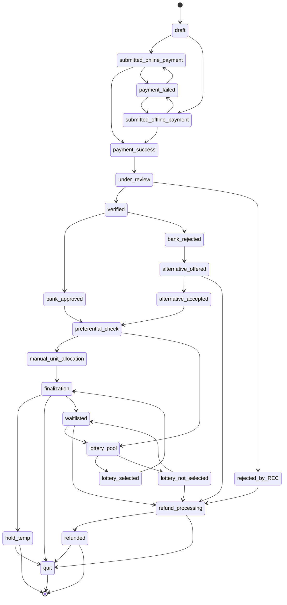
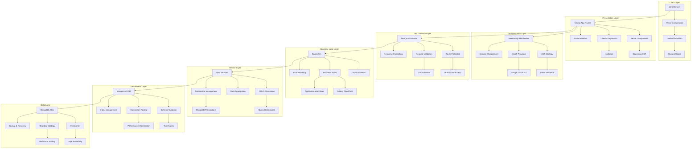
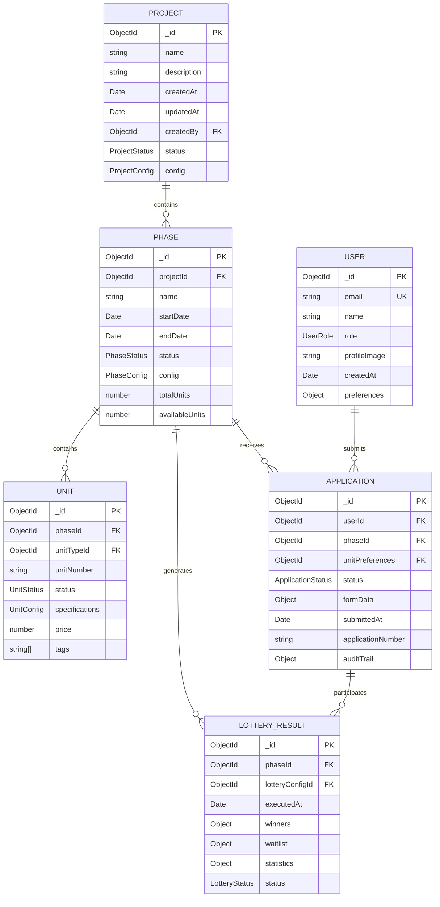

```mermaid
graph TB
    subgraph "Frontend Layer"
        A[Next.js App Router] --> B[Admin Dashboard]
        A --> C[User Dashboard]
        A --> D[Booking System]
        A --> E[Public Pages]
    end

    subgraph "Authentication"
        F[NextAuth.js] --> G[Google OAuth]
        F --> H[Credentials Auth]
        F --> I[Session Management]
    end

    subgraph "API Layer"
        J[Next.js API Routes] --> K[Project Management]
        J --> L[Application Processing]
        J --> M[Lottery System]
        J --> N[User Management]
        J --> O[File Upload]
    end

    subgraph "Business Logic"
        P[Controllers] --> Q[Project Controller]
        P --> R[Application Controller]
        P --> S[Lottery Controller]
        P --> T[User Controller]
        P --> U[Phase Controller]
        
        V[Services] --> W[Application Service]
        V --> X[Lottery Service]
        V --> Y[Project Service]
        V --> Z[User Service]
    end

    subgraph "Data Layer"
        AA[MongoDB Atlas] --> BB[Projects Collection]
        AA --> CC[Users Collection]
        AA --> DD[Applications Collection]
        AA --> EE[Phases Collection]
        AA --> FF[Units Collection]
        AA --> GG[Lottery Results Collection]
    end

    subgraph "External Services"
        HH[Email Service] --> II[Nodemailer]
        JJ[File Storage] --> KK[Google Cloud Storage]
        LL[PDF Generation] --> MM[jsPDF]
    end

    %% Connections
    A --> F
    A --> J
    J --> P
    P --> V
    V --> AA
    J --> HH
    J --> JJ
    J --> LL

    %% Styling
    classDef frontend fill:#e1f5fe
    classDef auth fill:#f3e5f5
    classDef api fill:#e8f5e8
    classDef business fill:#fff3e0
    classDef data fill:#ffebee
    classDef external fill:#f1f8e9

    class A,B,C,D,E frontend
    class F,G,H,I auth
    class J,K,L,M,N,O api
    class P,Q,R,S,T,U,V,W,X,Y,Z business
    class AA,BB,CC,DD,EE,FF,GG data
    class HH,II,JJ,KK,LL,MM external
```

# RELMS v2 - Real Estate Lottery Management System

A comprehensive Next.js application for managing real estate projects, applications, and lottery-based property allocation system.

## Table of Contents

1. [Overview](#overview)
2. [System Architecture](#system-architecture)
3. [Key Features](#key-features)
4. [Tech Stack](#tech-stack)
5. [Getting Started](#getting-started)
6. [Real Estate Lottery System Guide](#real-estate-lottery-system-guide)
7. [Technical Architecture](#technical-architecture)
8. [Database Schema](#database-schema)
9. [API Documentation](#api-documentation)
10. [Development Roadmap](#development-roadmap)
11. [Contributing](#contributing)

---

## Overview

The Real Estate Lottery Management System (RELMS) is a comprehensive platform designed to fairly and transparently allocate housing units to qualified applicants. The system combines sophisticated inventory management, configurable lottery algorithms, and detailed application lifecycle tracking to ensure equitable distribution of real estate properties.

### Why RELMS?

- **🏠 Fair Allocation**: Ensures transparent and unbiased property distribution
- **🎯 Configurable Rules**: Flexible scoring system adaptable to different housing programs
- **📊 Complete Transparency**: Full audit trails and explainable decisions
- **⚡ Scalable Platform**: Handle multiple projects and thousands of applications
- **🔒 Secure & Compliant**: Built-in regulatory compliance and security features

---

## System Architecture

### High-Level Architecture



### System Components

#### **Frontend Architecture**
- **Next.js 15** with App Router and Turbopack
- **React 19** with modern hooks and context
- **Tailwind CSS 4** for styling
- **Radix UI** components for accessibility
- **TypeScript** for type safety

#### **Backend Architecture**
- **Next.js API Routes** for serverless functions
- **MongoDB Atlas** with Mongoose ODM
- **NextAuth.js** for authentication
- **Google Cloud Storage** for file management
- **Nodemailer** for email notifications

---

## Key Features

### 🏢 **Admin Dashboard**
- **Project Management**: Create and manage real estate projects
- **Inventory Management**: Units, phases, unit types, and tags
- **Application Processing**: Review and manage user applications
- **Lottery System**: Configure and execute property allocation lotteries
- **Bulk Operations**: Excel-based bulk unit uploads
- **Kit Management**: Generate application kits and forms

### 👥 **User System** 
- **Multi-role Authentication**: Admin/Buyer roles with Google OAuth
- **Application Forms**: Dynamic form builder with conditional fields
- **Booking Process**: Multi-step application workflow
- **Payment Integration**: Kit payment processing
- **Document Generation**: PDF applications and receipts

### 🎲 **Lottery System**
- **Advanced Configuration**: Unit preferences, user preferences
- **Multi-round Lotteries**: Complex allocation algorithms
- **Result Management**: Automated result generation and notifications
- **Audit Trail**: Complete lottery history and transparency

### 📋 **Application Management**
- **Dynamic Forms**: JSON-based form definitions
- **Auto-save**: Real-time form data persistence  
- **Status Tracking**: Application lifecycle management
- **Print/Export**: PDF generation and kit management

---

## Tech Stack

| Layer | Technology |
|-------|------------|
| **Frontend** | Next.js 15, React 19, TypeScript |
| **Styling** | Tailwind CSS 4, Radix UI |
| **Authentication** | NextAuth.js, Google OAuth |
| **Database** | MongoDB Atlas, Mongoose ODM |
| **File Storage** | Google Cloud Storage |
| **Email** | Nodemailer |
| **PDF Generation** | jsPDF, html2canvas |
| **Validation** | Zod schemas |
| **State Management** | React Context, Hooks |

---

## Getting Started

### Prerequisites

- Node.js 20+ 
- MongoDB Atlas account
- Google OAuth credentials
- Google Cloud Storage bucket

### Installation

1. **Clone the repository**
   ```bash
   git clone <repository-url>
   cd relms-v2
   ```

2. **Install dependencies**
   ```bash
   npm install
   ```

3. **Set up environment variables**
   Create `.env.local` with:
   ```env
   MONGODB_URI=your_mongodb_connection_string
   NEXTAUTH_SECRET=your_nextauth_secret
   NEXTAUTH_URL=http://localhost:3000
   GOOGLE_CLIENT_ID=your_google_oauth_client_id
   GOOGLE_CLIENT_SECRET=your_google_oauth_client_secret
   ```

4. **Run the development server**
   ```bash
   npm run dev
   ```

5. **Open your browser**
   Visit [http://localhost:3000](http://localhost:3000)

### Available Scripts

- `npm run dev` - Start development server with Turbopack
- `npm run build` - Build for production
- `npm run start` - Start production server
- `npm run lint` - Run ESLint
- `npm run seedForms` - Seed form definitions
- `npm run seedKit` - Seed application kits
- `npm run testEmail` - Test email functionality

### Project Structure

```
relms-v2/
├── app/                          # Next.js App Router
│   ├── admin/                    # Admin dashboard pages
│   │   └── dashboard/[projectId]/
│   │       ├── inventory-management/  # Unit/Phase management
│   │       ├── kit-management/        # Application kit management
│   │       └── lottery/              # Lottery configuration
│   ├── api/                      # API routes
│   │   ├── applications/         # Application CRUD operations
│   │   ├── project/             # Project management APIs
│   │   └── auth/                # Authentication endpoints
│   ├── bookings/                # User booking workflow
│   └── user/                    # User dashboard
├── components/                  # Reusable UI components
│   └── ui/                     # Base UI components
├── controllers/                # Business logic controllers
├── services/                   # Data access services
├── schemas/                    # MongoDB schemas
├── types/                      # TypeScript type definitions
├── lib/                        # Utility libraries
└── middleware.ts               # Next.js middleware
```

---

## Real Estate Lottery System - Comprehensive Guide

*A detailed guide for understanding how the lottery allocation system works*

### Table of Contents

1. [Lottery Overview](#lottery-overview-1)
2. [Inventory Structure Guide](#inventory-structure-guide-1)
3. [Application Lifecycle Flow](#application-lifecycle-flow-1)
4. [How the Lottery Works](#how-the-lottery-works-1)
5. [Configuration Examples](#configuration-examples-1)
6. [Understanding Bias vs Fairness](#understanding-bias-vs-fairness-1)
7. [Visual Score Calculation](#visual-score-calculation-1)
8. [Practical Tuning Advice](#practical-tuning-advice-1)
9. [Lottery System Summary](#lottery-system-summary-1)

---

### Lottery Overview

The Real Estate Lottery Management System (RELMS) is a comprehensive platform designed to fairly and transparently allocate housing units to qualified applicants. The system combines sophisticated inventory management, configurable lottery algorithms, and detailed application lifecycle tracking to ensure equitable distribution of real estate properties.

#### Key Features

- **📋 Comprehensive Application Management**: End-to-end application processing from draft to finalization
- **🏠 Dynamic Inventory Control**: Real-time unit availability and allocation state management
- **🎯 Configurable Lottery Engine**: Flexible scoring rules and preference weights
- **📊 Transparent Process**: Complete audit trails and explainable allocation decisions
- **🔄 Multi-Phase Support**: Handle complex projects with multiple development phases
- **💳 Integrated Payment Processing**: Online and offline payment verification workflows
- **📈 Analytics & Reporting**: Comprehensive insights into lottery performance and outcomes

#### System Architecture

RELMS is built on a modular architecture that separates business logic from configuration, enabling:

- **Flexibility**: Adapt to different housing programs without code changes
- **Scalability**: Handle multiple projects and thousands of applications simultaneously
- **Transparency**: Complete traceability of all decisions and state changes
- **Compliance**: Built-in audit trails and regulatory compliance features

---

### Inventory Structure Guide

The Real Estate Lottery Management System (RELMS) organizes property inventory in a hierarchical structure to efficiently manage multiple projects, phases, and unit types.

#### Inventory Hierarchy

```
🏢 PROJECT
├── 📋 Project Details (Name, Location, Developer, Status)
├── 🏗️ PHASES
│   ├── Phase 1
│   │   ├── 📊 Phase Configuration (Timeline, Rules, Pricing)
│   │   ├── 🏠 UNIT TYPES
│   │   │   ├── 1BHK Units
│   │   │   │   ├── Unit A-101 (available/allotted/sold/preferred/hold)
│   │   │   │   ├── Unit A-102 (available/allotted/sold/preferred/hold)
│   │   │   │   └── Unit A-103 (available/allotted/sold/preferred/hold)
│   │   │   ├── 2BHK Units
│   │   │   │   ├── Unit B-201 (available/allotted/sold/preferred/hold)
│   │   │   │   └── Unit B-202 (available/allotted/sold/preferred/hold)
│   │   │   └── 3BHK Units
│   │   │       └── Unit C-301 (available/allotted/sold/preferred/hold)
│   │   └── 🎯 LOTTERY CONFIGURATION
│   │       ├── Scoring Rules
│   │       ├── Preference Weights
│   │       └── Allocation Strategy
│   └── Phase 2
│       └── (Similar structure)
└── 📈 PROJECT ANALYTICS
    ├── Sales Performance
    ├── Lottery Results
    └── Customer Demographics
```

#### Key Components

##### **1. Project Level**
- **Project ID**: Unique identifier for each real estate project
- **Basic Information**: Name, location, developer details, total units
- **Status Tracking**: Planning, Active, Completed, Suspended
- **Financial Overview**: Total value, pricing strategy, payment terms

##### **2. Phase Management**
- **Phase Segmentation**: Projects divided into manageable phases
- **Timeline Control**: Start/end dates, milestone tracking
- **Configuration Inheritance**: Phases can inherit or override project settings
- **Independent Lotteries**: Each phase can run separate lottery processes

##### **3. Unit Inventory**
- **Unit Types**: 1BHK, 2BHK, 3BHK, Penthouse, etc.
- **Unit Specifications**: Size, floor, facing, amenities, pricing
- **Allocation State**: available, allotted, sold, preferred, hold
- **Unit Status**: Active, Hold, Landowner, Sold
- **Allocation Tracking**: Winner assignment, payment status, handover

#### Dynamic Configuration Features

##### **Real-Time Status Updates**
```json
{
  "unitId": "A-101",
  "allocationState": "available",
  "unitStatus": "Active",
  "lastUpdated": "2024-01-15T10:30:00Z",
  "allottedApplicationId": null,
  "isVisible": true
}
```

##### **Batch Operations**
- **Bulk Status Updates**: Mark multiple units as available/sold
- **Price Adjustments**: Apply pricing changes across unit types
- **Configuration Deployment**: Roll out lottery rules to multiple phases

##### **Inventory Analytics**
- **Availability Reports**: Real-time unit availability across projects
- **Sales Performance**: Conversion rates, popular unit types
- **Demand Analysis**: Application patterns, preference trends
- **Revenue Tracking**: Sales value, payment collection status

---

### Application Lifecycle Flow

The Real Estate Lottery Management System (RELMS) follows a comprehensive application lifecycle that guides each applicant through various stages from initial draft to final allocation or exit.

#### Application Lifecycle State Diagram



#### Stage Descriptions

##### **Initial Application Stages**

**1. Draft**
- Application is being created/edited by applicant
- No payment required at this stage
- Can transition to either online or offline payment submission

**2. Submitted (Payment Processing)**
- `submitted_online_payment`: Application submitted with online payment
- `submitted_offline_payment`: Application submitted with offline payment method
- Awaiting payment confirmation

##### **Payment Verification**

**3. Payment Status**
- `payment_success`: Payment confirmed and processed successfully
- `payment_failed`: Payment processing failed, returns to submission stage

##### **Review and Verification Process**

**4. Under Review**
- Application documents and eligibility being reviewed by REC (Real Estate Committee)
- Can proceed to verification or be rejected

**5. Verification Outcomes**
- `verified`: Application meets all eligibility criteria
- `rejected_by_REC`: Application rejected due to eligibility issues, proceeds to refund

##### **Bank Approval Process**

**6. Bank Decision**
- `bank_approved`: Financial verification successful
- `bank_rejected`: Bank rejects the application for financing

**7. Alternative Process** (for bank rejected applications)
- `alternative_offered`: System offers alternative units/terms
- `alternative_accepted`: Applicant accepts the alternative offer

##### **Allocation Process**

**8. Preferential Check**
- System checks if applicant qualifies for preferential allocation
- Routes to either manual allocation or lottery pool

**9. Allocation Methods**
- `manual_unit_allocation`: Direct allocation for preferential candidates
- `lottery_pool`: Added to lottery system for random/weighted selection

##### **Lottery Outcomes**

**10. Lottery Results**
- `lottery_selected`: Won a unit in the lottery
- `lottery_not_selected`: Not selected in lottery

##### **Final Stages**

**11. Finalization**
- Unit allocation confirmed, paperwork and agreements processing
- Can lead to temporary hold, completion, or return to waitlist

**12. Exit States**
- `hold_temp`: Temporary hold status
- `quit`: Application terminated/withdrawn
- `waitlisted`: Placed on waitlist for future opportunities
- `refunded`: Refund processed for unsuccessful applications

#### Key Lifecycle Features

##### **Flexible Pathways**
- Multiple entry points for different payment methods
- Alternative pathways for rejected applications
- Circular flows for waitlisted applicants

##### **Quality Gates**
- Payment verification checkpoint
- REC review and approval
- Bank financial verification
- Preferential eligibility assessment

##### **Recovery Mechanisms**
- Failed payments can retry with different methods
- Bank-rejected applications get alternative offers
- Waitlisted applications can re-enter lottery pools
- Comprehensive refund processing for unsuccessful cases

---

### How the Lottery Works

The Real Estate Lottery System is designed to fairly allocate available housing units to applicants based on configurable scoring rules. Think of it as a sophisticated "weighted raffle" system.

#### Step-by-Step Process

##### 1. **Applications Collection**
- People submit applications with their personal information (income, occupation, family size, etc.)
- All valid applications go into a "lottery pool"

##### 2. **Scoring Each Applicant**
- The system calculates a score for each applicant based on predefined rules
- **Score Formula**: `Total Score = (Rule 1 Score) + (Rule 2 Score) + ... + (Rule N Score)`
- **Individual Rule Score**: `Base Weight × Value Weight`

##### 3. **Ranking Applicants**
- All applicants are sorted by their total score (highest to lowest)
- Higher scores = better chance of getting a unit

##### 4. **Unit Allocation**
- Winners are selected starting from the highest score
- If there are 10 units available, the top 10 scored applicants win
- **Tie-breaking**: If multiple people have the same score at the cutoff point, winners are chosen randomly among them

##### 5. **Results**
- **Winners**: Get assigned a specific unit
- **Waitlist**: Remaining applicants are ranked in order for future availability

#### Real Example
Let's say there are **3 units available** and **5 applicants**:

| Applicant | Score | Result |
|-----------|-------|--------|
| Alice     | 8.5   | ✅ **Winner** (Unit A) |
| Bob       | 7.2   | ✅ **Winner** (Unit B) |
| Charlie   | 7.2   | ✅ **Winner** (Unit C) - *Random selection among tied scores* |
| Diana     | 7.2   | ❌ Waitlist #1 - *Random selection among tied scores* |
| Eve       | 5.1   | ❌ Waitlist #2 |

---

### Configuration Examples

#### Example 1: Basic Income-Based Preference

**Scenario**: Prioritize lower-income applicants for affordable housing

```json
{
  "userPreferenceRules": [
    {
      "formId": "personalInfo",
      "fieldName": "grossAnnualIncome",
      "baseWeight": 1.0,
      "valueMap": [
        { "value": "Below 3 Lakhs", "weight": 3.0 },
        { "value": "3-6 Lakhs", "weight": 2.0 },
        { "value": "6-10 Lakhs", "weight": 1.0 },
        { "value": "Above 10 Lakhs", "weight": 0.5 }
      ]
    }
  ]
}
```

**What this does**:
- Someone earning "Below 3 Lakhs" gets: `1.0 × 3.0 = 3.0 points`
- Someone earning "Above 10 Lakhs" gets: `1.0 × 0.5 = 0.5 points`

#### Example 2: Multi-Factor Scoring

**Scenario**: Consider income, occupation, and disability status

```json
{
  "userPreferenceRules": [
    {
      "formId": "personalInfo",
      "fieldName": "grossAnnualIncome",
      "baseWeight": 0.5,
      "valueMap": [
        { "value": "Below 3 Lakhs", "weight": 3.0 },
        { "value": "3-6 Lakhs", "weight": 2.0 },
        { "value": "Above 6 Lakhs", "weight": 1.0 }
      ]
    },
    {
      "formId": "personalInfo", 
      "fieldName": "occupation",
      "baseWeight": 0.3,
      "valueMap": [
        { "value": "Govt. Service", "weight": 2.5 },
        { "value": "Private Service", "weight": 2.0 },
        { "value": "Self Employed", "weight": 1.5 },
        { "value": "Unemployed", "weight": 3.0 }
      ]
    },
    {
      "formId": "personalInfo",
      "fieldName": "isDisabled", 
      "baseWeight": 0.8,
      "valueMap": [
        { "value": "true", "weight": 2.0 },
        { "value": "false", "weight": 1.0 }
      ]
    }
  ]
}
```

**Sample Calculation**:
For an applicant who is:
- Low income (Below 3 Lakhs): `0.5 × 3.0 = 1.5`
- Government employee: `0.3 × 2.5 = 0.75`
- Not disabled: `0.8 × 1.0 = 0.8`
- **Total Score**: `1.5 + 0.75 + 0.8 = 3.05`

#### Example 3: Fair/Balanced Configuration

**Scenario**: Minimize bias by using equal weights

```json
{
  "userPreferenceRules": [
    {
      "formId": "personalInfo",
      "fieldName": "grossAnnualIncome",
      "baseWeight": 1.0,
      "valueMap": [
        { "value": "Below 3 Lakhs", "weight": 1.2 },
        { "value": "3-6 Lakhs", "weight": 1.1 },
        { "value": "6-10 Lakhs", "weight": 1.0 },
        { "value": "Above 10 Lakhs", "weight": 0.9 }
      ]
    },
    {
      "formId": "personalInfo",
      "fieldName": "familySize", 
      "baseWeight": 1.0,
      "valueMap": [
        { "value": "1-2 members", "weight": 0.9 },
        { "value": "3-4 members", "weight": 1.0 },
        { "value": "5+ members", "weight": 1.1 }
      ]
    }
  ]
}
```

---

### Understanding Bias vs Fairness

#### What is Bias in This Context?

**Bias** occurs when the lottery system heavily favors specific groups over others. This isn't necessarily bad - it depends on your housing program's goals.

#### What is Fairness?

**Fairness** means giving more equal opportunities to all applicants, regardless of their characteristics.

#### The Bias-Fairness Spectrum

```
HIGH BIAS                           BALANCED                         HIGH FAIRNESS
(Strong Preferences)                                                (Equal Treatment)
        |                              |                                    |
   Targets specific              Some preference for           Nearly equal chance
   groups heavily               priority groups               for all applicants
```

#### Visual Example: Weight Impact

Consider scoring based on income level:

##### **High Bias Configuration** (Strongly favors high income)
```json
"valueMap": [
  { "value": "Low Income", "weight": 0.2 },     // 📉 Major disadvantage
  { "value": "Medium Income", "weight": 1.0 },  // 📊 Baseline
  { "value": "High Income", "weight": 5.0 }     // 📈 Very high advantage
]
```

**Result**: High-income applicants have 25x better scoring than low-income applicants

##### **Balanced Configuration** (Moderate preference)
```json
"valueMap": [
  { "value": "Low Income", "weight": 0.8 },     // 📉 Slight disadvantage  
  { "value": "Medium Income", "weight": 1.0 },  // 📊 Baseline
  { "value": "High Income", "weight": 1.3 }     // 📈 Slight advantage
]
```

**Result**: High-income applicants have 1.6x better scoring than low-income applicants

##### **Fair Configuration** (Nearly equal treatment)
```json
"valueMap": [
  { "value": "Low Income", "weight": 1.0 },     // 📊 Equal
  { "value": "Medium Income", "weight": 1.0 },  // 📊 Equal  
  { "value": "High Income", "weight": 1.0 }     // 📊 Equal
]
```

**Result**: All income groups have equal opportunity

#### Bias Warning Signs

❌ **High Bias Indicators**:
- Weight differences greater than 3:1 ratio
- Only one group gets high weights while others get very low weights
- Many rules all favor the same small group

✅ **Balanced Indicators**:
- Weight differences within 2:1 ratio
- Multiple groups receive preference across different rules
- Diverse criteria that don't all benefit the same applicants

---

### Visual Score Calculation

#### Score Calculation Flowchart

```
    📋 APPLICANT DATA
            ↓
    ⚖️  SCORING RULES
            ↓
   📊 INDIVIDUAL RULE SCORES
            ↓
   ➕ TOTAL SCORE CALCULATION  
            ↓
   📈 RANKING & SELECTION
            ↓
   🏠 UNIT ALLOCATION
```

#### Detailed Examples: Fairness vs Bias vs Randomization

Let's walk through concrete examples showing how different configurations affect outcomes, including how randomization works for tie-breaking.

##### **Scenario Setup**
We have **3 units available** and **6 applicants** with the following profiles:

| Applicant | Income | Credit Score | Occupation |
|-----------|--------|--------------|------------|
| **Alice** | High (₹12L) | Excellent | Private Service |
| **Bob** | Medium (₹5L) | Good | Govt Service |
| **Charlie** | Low (₹2L) | Poor | Unemployed |
| **Diana** | High (₹15L) | Excellent | Private Service |
| **Eve** | Medium (₹6L) | Good | Private Service |
| **Frank** | Low (₹3L) | Good | Govt Service |

##### **Example 1: FAIR Configuration (Equal Treatment)**

**Configuration:**
```json
{
  "userPreferenceRules": [
    {
      "fieldName": "grossAnnualIncome",
      "baseWeight": 1.0,
      "valueMap": [
        { "value": "Low", "weight": 1.0 },
        { "value": "Medium", "weight": 1.0 },
        { "value": "High", "weight": 1.0 }
      ]
    },
    {
      "fieldName": "creditScore",
      "baseWeight": 1.0,
      "valueMap": [
        { "value": "Poor", "weight": 1.0 },
        { "value": "Good", "weight": 1.0 },
        { "value": "Excellent", "weight": 1.0 }
      ]
    },
    {
      "fieldName": "occupation",
      "baseWeight": 1.0,
      "valueMap": [
        { "value": "Unemployed", "weight": 1.0 },
        { "value": "Private Service", "weight": 1.0 },
        { "value": "Govt Service", "weight": 1.0 }
      ]
    }
  ]
}
```

**Score Calculations:**
- **All applicants**: (1.0 × 1.0) + (1.0 × 1.0) + (1.0 × 1.0) = **3.0**

**Result:** All applicants have identical scores = **3.0**

**🎲 RANDOMIZATION KICKS IN:**
Since all 6 applicants are tied at 3.0 and we need to select 3 winners, the system randomly selects 3 out of 6.

**Possible Outcome:**
- ✅ **Winners** (randomly selected): Bob, Eve, Frank
- ❌ **Waitlist**: Alice (#1), Diana (#2), Charlie (#3)

**Fairness Level**: 100% - Everyone has equal opportunity

##### **Example 2: BIASED Configuration (Favors High Income)**

**Configuration:**
```json
{
  "userPreferenceRules": [
    {
      "fieldName": "grossAnnualIncome",
      "baseWeight": 3.0,
      "valueMap": [
        { "value": "Low", "weight": 0.5 },
        { "value": "Medium", "weight": 1.5 },
        { "value": "High", "weight": 4.0 }
      ]
    },
    {
      "fieldName": "creditScore",
      "baseWeight": 2.0,
      "valueMap": [
        { "value": "Poor", "weight": 0.3 },
        { "value": "Good", "weight": 1.5 },
        { "value": "Excellent", "weight": 3.0 }
      ]
    },
    {
      "fieldName": "occupation",
      "baseWeight": 1.0,
      "valueMap": [
        { "value": "Unemployed", "weight": 0.2 },
        { "value": "Private Service", "weight": 2.0 },
        { "value": "Govt Service", "weight": 2.5 }
      ]
    }
  ]
}
```

**Score Calculations:**
- **Alice**: (3.0 × 4.0) + (2.0 × 3.0) + (1.0 × 2.0) = 12.0 + 6.0 + 2.0 = **20.0**
- **Bob**: (3.0 × 1.5) + (2.0 × 1.5) + (1.0 × 2.5) = 4.5 + 3.0 + 2.5 = **10.0**
- **Charlie**: (3.0 × 0.5) + (2.0 × 0.3) + (1.0 × 0.2) = 1.5 + 0.6 + 0.2 = **2.3**
- **Diana**: (3.0 × 4.0) + (2.0 × 3.0) + (1.0 × 2.0) = 12.0 + 6.0 + 2.0 = **20.0**
- **Eve**: (3.0 × 1.5) + (2.0 × 1.5) + (1.0 × 2.0) = 4.5 + 3.0 + 2.0 = **9.5**
- **Frank**: (3.0 × 0.5) + (2.0 × 1.5) + (1.0 × 2.5) = 1.5 + 3.0 + 2.5 = **7.0**

**Final Result:**
- ✅ **Winners**: Alice, Diana, Bob
- ❌ **Waitlist**: Eve (#1), Frank (#2), Charlie (#3)

**Bias Level**: High - Strongly favors high-income applicants (Alice/Diana scored 8.7x higher than Charlie)

---

### Practical Tuning Advice

#### For Prioritizing Fairness (Equal Opportunity)

##### ✅ **Do This:**
1. **Use similar base weights** across all rules (e.g., all between 0.8-1.2)
2. **Keep value weight ratios small** (max 2:1 difference)
3. **Include diverse criteria** that benefit different groups
4. **Test different combinations** and review the results

##### **Example Fair Configuration:**
```json
{
  "userPreferenceRules": [
    {
      "fieldName": "grossAnnualIncome",
      "baseWeight": 1.0,
      "valueMap": [
        { "value": "Low", "weight": 1.1 },
        { "value": "Medium", "weight": 1.0 },
        { "value": "High", "weight": 0.9 }
      ]
    },
    {
      "fieldName": "familySize", 
      "baseWeight": 1.0,
      "valueMap": [
        { "value": "Small", "weight": 0.9 },
        { "value": "Medium", "weight": 1.0 },
        { "value": "Large", "weight": 1.1 }
      ]
    },
    {
      "fieldName": "residencyDuration",
      "baseWeight": 1.0, 
      "valueMap": [
        { "value": "New", "weight": 0.9 },
        { "value": "Medium", "weight": 1.0 },
        { "value": "Long-term", "weight": 1.1 }
      ]
    }
  ]
}
```

#### For Prioritizing Bias (Targeted Preferences)

##### ✅ **Do This:**
1. **Use high base weights** for priority characteristics (1.5-3.0)
2. **Create large value weight differences** (up to 5:1 ratio)
3. **Align multiple rules** to benefit the same target groups
4. **Clearly document the intended beneficiaries**

##### **Example Biased Configuration:**
```json
{
  "userPreferenceRules": [
    {
      "fieldName": "grossAnnualIncome",
      "baseWeight": 2.0,
      "valueMap": [
        { "value": "Below 3 Lakhs", "weight": 0.5 },
        { "value": "3-6 Lakhs", "weight": 2.0 },
        { "value": "Above 6 Lakhs", "weight": 4.0 }
      ]
    },
    {
      "fieldName": "creditScore",
      "baseWeight": 1.5,
      "valueMap": [
        { "value": "Poor", "weight": 0.5 },
        { "value": "Good", "weight": 2.0 },
        { "value": "Excellent", "weight": 3.0 }
      ]
    },
    {
      "fieldName": "occupation",
      "baseWeight": 1.2,
      "valueMap": [
        { "value": "Unemployed", "weight": 0.3 },
        { "value": "Private Service", "weight": 2.0 },
        { "value": "Govt. Service", "weight": 3.5 }
      ]
    }
  ]
}
```

#### Testing and Validation

##### **Before Going Live:**

1. **Run test scenarios** with sample data
2. **Calculate scores** for different applicant profiles
3. **Check if results align** with your program goals
4. **Document your reasoning** for the chosen weights

##### **Sample Test Cases:**

| Profile | Income | Occupation | Disabled | Expected Outcome |
|---------|--------|------------|----------|------------------|
| Profile A | Low | Unemployed | Yes | Should score very high |
| Profile B | High | Private | No | Should score lower |
| Profile C | Medium | Govt | No | Should score medium |

##### **Monitoring After Launch:**

- Track which groups are winning most units
- Collect feedback from applicants and stakeholders
- Adjust weights if results don't match intended goals
- Keep audit logs of all configuration changes

#### Common Mistakes to Avoid

❌ **Don't:**
- Set all base weights to 0 (everyone gets same score)
- Create impossible combinations (conflicting high preferences)
- Change weights during an active lottery period
- Ignore testing with real data

✅ **Do:**
- Start with moderate settings and adjust gradually
- Keep detailed documentation of all changes
- Involve stakeholders in reviewing configurations
- Plan for edge cases and tie-breaking scenarios

---

### Lottery System Summary

The Real Estate Lottery Management System (RELMS) provides a comprehensive, flexible, and transparent platform for managing real estate allocations through a fair lottery process.

#### Key Takeaways

##### **System Capabilities**
1. **Inventory Management**: Hierarchical organization of projects, phases, and units with real-time status tracking
2. **Application Lifecycle**: Complete workflow from draft application to final allocation with audit trails
3. **Lottery Engine**: Configurable scoring system that can balance fairness with targeted preferences
4. **Transparency**: Full explainability of scoring decisions and allocation outcomes

##### **Configuration Principles**
1. **Scoring Mechanics**: Base Weight × Value Weight determines each rule's contribution to total score
2. **Bias vs Fairness**: Weight differences control preference strength - larger differences create more bias
3. **Impact Assessment**: Small configuration changes can significantly affect allocation outcomes
4. **Testing Strategy**: Always validate configurations with sample data before deployment

##### **Best Practices**
- Start with moderate settings and adjust incrementally
- Document all configuration decisions and rationale
- Involve stakeholders in reviewing and approving lottery rules
- Monitor outcomes and adjust based on program goals
- Maintain comprehensive audit trails for regulatory compliance

#### Getting Started

1. **Review Inventory Structure**: Understand how your projects and units are organized
2. **Map Application Flow**: Familiarize yourself with the application lifecycle stages
3. **Configure Lottery Rules**: Set up scoring criteria based on your program objectives
4. **Test Thoroughly**: Run scenarios with sample data to validate expected outcomes
5. **Deploy and Monitor**: Launch your lottery and track results against goals

---

## Technical Architecture

### System Architecture Layers



### Security Implementation

#### Authentication & Authorization
```typescript
// JWT Token Structure
interface JWTPayload {
  id: string;
  email: string;
  role: 'ADMIN' | 'BUYER';
  picture?: string;
  iat: number;
  exp: number;
}

// Protected Routes
const protectedRoutes = [
  '/admin/**',
  '/api/admin/**',
  '/user/dashboard',
  '/bookings/**'
];
```

#### Performance Optimization
```typescript
// Database Indexing Strategy
db.applications.createIndex({ "userId": 1, "phaseId": 1 });
db.applications.createIndex({ "status": 1, "submittedAt": -1 });
db.units.createIndex({ "phaseId": 1, "status": 1 });
```

### Lottery Algorithm Implementation

```typescript
interface LotteryConfig {
  algorithm: 'RANDOM' | 'WEIGHTED' | 'PREFERENCE_BASED';
  preferences: {
    unitType: number;
    location: number;
    price: number;
  };
  fairnessRules: {
    maxUnitsPerUser: number;
    priorityGroups: string[];
  };
}

class LotteryEngine {
  async executeLottery(phaseId: string, config: LotteryConfig) {
    const applications = await this.getEligibleApplications(phaseId);
    const availableUnits = await this.getAvailableUnits(phaseId);
    
    const allocations = await this.runAllocationAlgorithm(
      applications,
      availableUnits,
      config
    );
    
    return this.processResults(allocations);
  }
}
```

---

## Database Schema

### MongoDB Collections



### Core Collections

- **Projects**: Real estate project information
- **Phases**: Project phases with timing and configuration
- **Units**: Individual property units with details and availability
- **Applications**: User applications with form data and status
- **Users**: User profiles with roles and authentication data
- **LotteryResults**: Lottery execution results and allocations

---

## API Documentation

### Authentication Endpoints
- `POST /api/auth/signin` - User login
- `POST /api/auth/signout` - User logout
- `GET /api/auth/session` - Get current session

### Application Management
- `GET /api/applications` - List applications with filters
- `POST /api/applications` - Create new application
- `PUT /api/applications/[id]` - Update application
- `DELETE /api/applications/[id]` - Delete application

### Project Management
- `GET /api/project` - List projects
- `POST /api/project` - Create project
- `GET /api/project/[id]` - Get project details
- `PUT /api/project/[id]` - Update project

### Lottery System
- `POST /api/project/[id]/phases/[phaseId]/lottery` - Configure lottery
- `POST /api/project/[id]/phases/[phaseId]/lottery/trigger` - Execute lottery
- `GET /api/project/[id]/phases/[phaseId]/lottery/results` - Get results

---

## Development Roadmap

### 🚧 **Not Yet Implemented**

#### Security & Performance
- [ ] **Rate Limiting** - API rate limiting with Redis/Upstash
- [ ] **Redis Caching** - Session and data caching
- [ ] **Content Security Policy** - Add CSP headers
- [ ] **Input Sanitization** - DOMPurify integration
- [ ] **CSRF Protection** - Anti-CSRF tokens

#### Monitoring & Observability
- [ ] **Winston Logger** - Structured logging
- [ ] **Metrics Collection** - Performance metrics
- [ ] **Health Check Endpoints** - `/api/health` and `/api/ready`
- [ ] **Error Tracking** - Centralized monitoring
- [ ] **Performance Monitoring** - Core Web Vitals

#### Infrastructure & Deployment
- [ ] **Docker Configuration** - Multi-stage Dockerfile
- [ ] **Kubernetes Deployment** - Production manifests
- [ ] **CI/CD Pipeline** - GitHub Actions workflow
- [ ] **Backup Scripts** - Automated MongoDB backups
- [ ] **Load Balancing** - Multi-instance deployment


#### Documentation
- [ ] **API Documentation** - OpenAPI/Swagger specs
- [ ] **Developer Guide** - Detailed documentation
- [ ] **Deployment Guide** - Production instructions
- [ ] **User Manual** - End-user documentation

### ✅ **Currently Implemented**

- Authentication with NextAuth.js and Google OAuth
- MongoDB database with Mongoose ODM
- Next.js 15 with App Router and Turbopack
- Dynamic form builder with JSON configuration
- Lottery system with multiple algorithms
- File upload with Google Cloud Storage
- Email notifications with Nodemailer
- PDF generation for applications
- Role-based access control (Admin/Buyer)
- Multi-step booking workflow
- Bulk Excel upload functionality
- Application status tracking
- Project and phase management
- Unit inventory management

---

## Contributing

1. **Fork the repository**
2. **Create a feature branch**: `git checkout -b feature/amazing-feature`
3. **Commit changes**: `git commit -m 'Add amazing feature'`
4. **Push to branch**: `git push origin feature/amazing-feature`
5. **Open a Pull Request**

### Development Guidelines

- Follow TypeScript best practices
- Use conventional commit messages
- Write comprehensive tests
- Update documentation for new features
- Follow the established code style

### Getting Help

- Check existing issues and discussions
- Create detailed bug reports with reproduction steps
- Provide context and environment information
- Follow the issue templates

---

## License

This project is private and proprietary. All rights reserved.

---

Built with ❤️ using Next.js, React, and MongoDB
